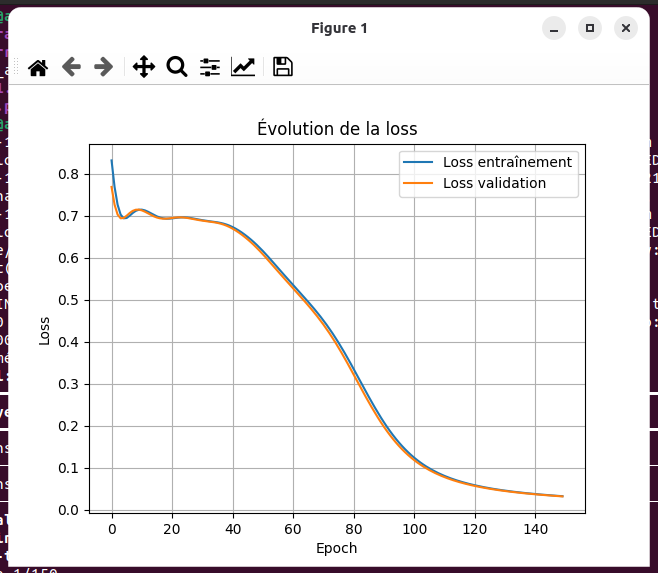
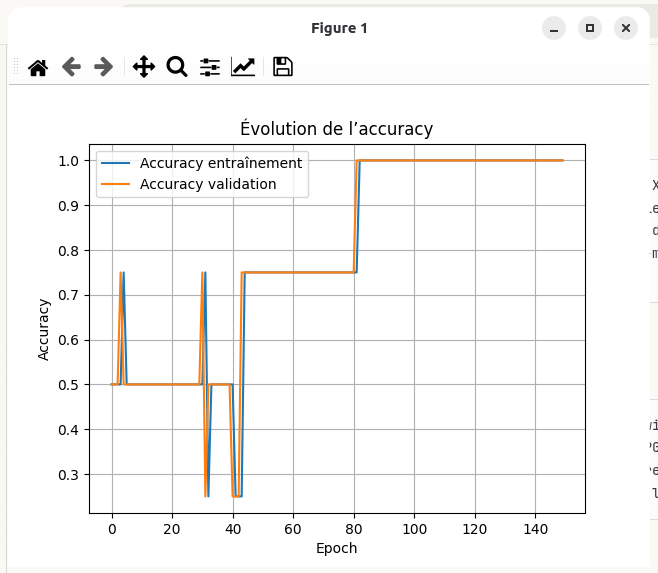
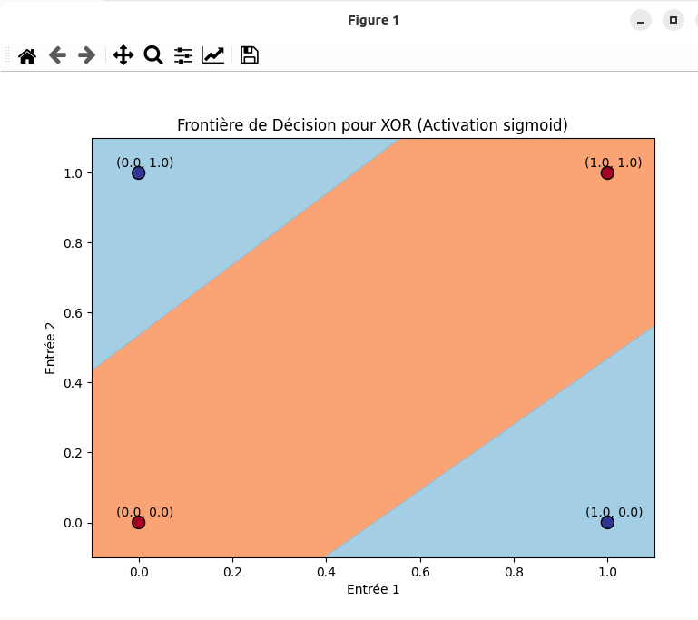

# Neural Network XOR - FPGA Implementation


Implémentation complète d'un réseau de neurones artificiel pour résoudre le problème classique XOR : entraînement logiciel avec TensorFlow/Keras et déploiement matériel sur FPGA en VHDL. Ce projet démontre le pipeline complet du logiciel au matériel pour l'intelligence artificielle embarquée.

## Table des matières

- [Vue d'ensemble](#-vue-densemble)
- [Problème XOR](#-problème-xor)
- [Architecture du réseau](#-architecture-du-réseau)
- [Partie logicielle (Python)](#-partie-logicielle-python)
- [Partie matérielle (VHDL)](#-partie-matérielle-vhdl)
- [Installation](#-installation)
- [Utilisation](#-utilisation)
- [Résultats](#-résultats)
- [Structure du projet](#-structure-du-projet)
- [Licence](#-licence)

## Vue d'ensemble

Ce projet illustre l'implémentation d'un réseau de neurones artificiel à deux niveaux :

1. **Niveau logiciel** : Entraînement avec TensorFlow/Keras (Python)
   - Construction du modèle
   - Entraînement sur la fonction XOR
   - Visualisation des performances (loss, accuracy)
   - Affichage des frontières de décision
   - Extraction des poids et biais

2. **Niveau matériel** : Déploiement sur FPGA (VHDL)
   - Implémentation matérielle du réseau entraîné
   - Calcul en virgule fixe
   - Simulation avec ModelSim
   - Synthèse pour FPGA

### Pourquoi XOR ?

Le **XOR (OU exclusif)** est un problème classique en apprentissage automatique car :
- ❌ Non linéairement séparable (un perceptron simple ne peut pas le résoudre)
- ✅ Nécessite au moins une couche cachée
- ✅ Parfait pour démontrer l'apprentissage de fonctions non linéaires
- ✅ Compact (4 exemples seulement) mais représentatif

## Problème XOR

### Table de vérité

| Entrée 1 | Entrée 2 | Sortie XOR |
|----------|----------|------------|
| 0        | 0        | 0          |
| 0        | 1        | 1          |
| 1        | 0        | 1          |
| 1        | 1        | 0          |

### Représentation graphique

```
    Entrée 2
      ^
      |
    1 +     (0,1)●         (1,1)●
      |       [1]           [0]
      |
  0.5 +
      |
      |
    0 +     (0,0)●         (1,0)●
      |       [0]           [1]
      |
      +----+----+----+----+----+---> Entrée 1
           0   0.5   1

● Points bleus  : Sortie = 0
● Points rouges : Sortie = 1
```

Les points de même classe ne sont **pas** linéairement séparables !

## Architecture du réseau

### Structure

```
        Input Layer        Hidden Layer         Output Layer
           (2)                 (2)                  (1)
       
       ┌───┐                ┌───┐              
   x1 ─┤   ├───┬───────────┤   ├─────┐        
       └───┘   │    w11,w21 └───┘     │        
               │                      │   w1   ┌───┐
               │            ┌───┐     ├───────┤   ├─── ŷ
               │    w12,w22 │   │     │        └───┘
       ┌───┐   └───────────┤   ├─────┘         sigmoid
   x2 ─┤   ├────────────────└───┘      w2
       └───┘                sigmoid
                            + bias
```

### Spécifications

| Couche | Neurones | Activation | Paramètres |
|--------|----------|------------|------------|
| Input  | 2        | -          | 0          |
| Hidden | 2        | Sigmoid    | 6 (4W + 2b)|
| Output | 1        | Sigmoid    | 3 (2W + 1b)|
| **Total** | **5** | -       | **9**      |

**Fonction Sigmoid :**
```
σ(x) = 1 / (1 + e^(-x))
```

## Partie logicielle (Python)

### Fonctionnalités

Le script Python `neuron_xor.py` implémente :

1. **Construction du modèle**
   ```python
   model = tf.keras.Sequential([
       tf.keras.layers.Dense(2, activation='sigmoid', input_shape=(2,)),
       tf.keras.layers.Dense(1, activation='sigmoid')
   ])
   ```

2. **Entraînement**
   - Optimiseur : Adam (learning_rate=0.1)
   - Loss : Binary Crossentropy
   - Métrique : Accuracy
   - Epochs : 150
   - Données : 4 exemples XOR

3. **Visualisations**
   - 📉 Courbe de loss (entraînement + validation)
   - 📈 Courbe d'accuracy (entraînement + validation)
   - 🎨 Frontière de décision (contour plot 2D)

4. **Analyse du modèle**
   - Affichage des prédictions
   - Extraction des poids (W) et biais (b)
   - Caractéristiques détaillées de chaque couche

5. **Frontière de décision**
   - Grille de 100×100 points
   - Prédiction pour chaque point
   - Visualisation avec colormap (RdYlBu)

### Exemple de sortie

```
Résumé du modèle :
_________________________________________________________________
Layer (type)                Output Shape              Param #   
=================================================================
dense (Dense)               (None, 2)                 6         
dense_1 (Dense)             (None, 1)                 3         
=================================================================
Total params: 9

Prédictions sur la table XOR :
Entrée: [0. 0.]  →  Vrai: 0  |  Prédit: 0.0234  |  Arrondi: 0
Entrée: [0. 1.]  →  Vrai: 1  |  Prédit: 0.9812  |  Arrondi: 1
Entrée: [1. 0.]  →  Vrai: 1  |  Prédit: 0.9823  |  Arrondi: 1
Entrée: [1. 1.]  →  Vrai: 0  |  Prédit: 0.0187  |  Arrondi: 0
```

## Partie matérielle (VHDL)

### Objectif

Implémenter le réseau de neurones entraîné **directement en matériel** sur FPGA.

### Défis de l'implémentation matérielle

1. **Virgule fixe vs Virgule flottante**
   - Python : float32 (virgule flottante)
   - FPGA : virgule fixe (ex: Q8.8, Q16.16)
   - Nécessite quantification des poids

2. **Fonction Sigmoid**
   - Exponentielles coûteuses en matériel
   - Solutions : LUT (Look-Up Table), approximation polynomiale, CORDIC

3. **Pipeline et parallélisme**
   - Calculs parallèles des neurones
   - Optimisation du débit (throughput)

### Architecture VHDL proposée

```vhdl
entity xor_neural_net is
    Port (
        clk     : in  std_logic;
        rst     : in  std_logic;
        x1      : in  std_logic_vector(15 downto 0);  -- Q8.8
        x2      : in  std_logic_vector(15 downto 0);  -- Q8.8
        valid_in: in  std_logic;
        y_out   : out std_logic_vector(15 downto 0);  -- Q8.8
        valid_out: out std_logic
    );
end xor_neural_net;
```

### Modules VHDL

| Module | Description |
|--------|-------------|
| `neuron.vhd` | Neurone unique (MAC + activation) |
| `sigmoid_lut.vhd` | Table de correspondance sigmoid |
| `hidden_layer.vhd` | Couche cachée (2 neurones) |
| `output_layer.vhd` | Couche de sortie (1 neurone) |
| `xor_neural_net.vhd` | Top-level entity |
| `tb_xor_neural_net.vhd` | Testbench ModelSim |

### Simulation ModelSim

Le testbench vérifie les 4 cas XOR :

```vhdl
-- Testbench stimulus
process
begin
    -- Test case 1: (0, 0) → 0
    x1 <= x"0000"; x2 <= x"0000"; valid_in <= '1';
    wait for 10 ns;
    
    -- Test case 2: (0, 1) → 1
    x1 <= x"0000"; x2 <= x"0100"; valid_in <= '1';
    wait for 10 ns;
    
    -- Test case 3: (1, 0) → 1
    x1 <= x"0100"; x2 <= x"0000"; valid_in <= '1';
    wait for 10 ns;
    
    -- Test case 4: (1, 1) → 0
    x1 <= x"0100"; x2 <= x"0100"; valid_in <= '1';
    wait for 10 ns;
    
    wait;
end process;
```

### Quantification des poids

**Exemple de conversion Python → VHDL :**

```python
# Python (float32)
w1 = 4.8532

# VHDL (Q8.8 - 8 bits entier, 8 bits fractionnaire)
w1_fixed = int(4.8532 * 256)  # = 1242 = 0x04DA
```

En VHDL :
```vhdl
constant W1 : signed(15 downto 0) := x"04DA";  -- 4.8532 en Q8.8
```

## Installation

### Prérequis

**Partie Python :**
- Python 3.8+
- TensorFlow 2.x
- NumPy
- Matplotlib

**Partie VHDL :**
- ModelSim (Intel/Mentor Graphics)

### Installation Python

```bash
# Cloner le repository
git clone https://github.com/votre-username/Neural-Network-XOR-FPGA-Implementation.git
cd Neural-Network-XOR-FPGA-Implementation

# Créer un environnement virtuel (optionnel)
python -m venv venv
source venv/bin/activate  # Linux/Mac
# ou
venv\Scripts\activate     # Windows

# Installer les dépendances
pip install -r requirements.txt
```

**Fichier `requirements.txt` :**
```
tensorflow>=2.10.0
numpy>=1.23.0
matplotlib>=3.5.0
```

### Installation ModelSim

1. Télécharger [ModelSim-Intel FPGA Edition](https://www.intel.com/content/www/us/en/software-kit/750666/modelsim-intel-fpgas-standard-edition-software-version-20-1-1.html)
2. Installer et configurer le PATH
3. Vérifier l'installation :
   ```bash
   vsim -version
   ```

## Utilisation

### 1. Entraînement du réseau (Python)

```bash
python neuron_xor.py
```

**Sorties :**
- Résumé du modèle dans le terminal
- Graphiques de loss et accuracy (matplotlib)
- Frontière de décision
- Poids et biais extraits

### 2. Extraire les poids pour VHDL

Les poids sont affichés à la fin de l'exécution :

```
Poids et biais appris :
Poids (w) : [ 4.8532  4.9123 -7.1234 -7.0987]
Biais (b) : [-2.1234 -3.4567]
```

Convertir en virgule fixe :
```python
import numpy as np

# Format Q8.8 (8 bits entier, 8 bits fractionnaire)
scale = 256

weights_float = [4.8532, 4.9123, -7.1234, -7.0987]
weights_fixed = [int(w * scale) for w in weights_float]

print("Poids en Q8.8 (hex):")
for i, wf in enumerate(weights_fixed):
    print(f"W{i} : 0x{wf & 0xFFFF:04X}")
```

### 3. Simulation VHDL (ModelSim)

```bash
cd vhdl/

# Compiler les fichiers VHDL
vlib work
vcom neuron.vhd
vcom sigmoid_lut.vhd
vcom hidden_layer.vhd
vcom output_layer.vhd
vcom xor_neural_net.vhd
vcom tb_xor_neural_net.vhd

# Lancer la simulation
vsim -do sim.do tb_xor_neural_net

# Ou en mode GUI
vsim -gui work.tb_xor_neural_net
```

**Script `sim.do` :**
```tcl
# Ajouter les signaux à la fenêtre wave
add wave -radix hexadecimal /tb_xor_neural_net/*

# Exécuter la simulation
run 100 ns

# Zoom sur les signaux
wave zoom full
```

### 4. Synthèse FPGA

#### Pour Intel/Altera (Quartus)

```bash
quartus_sh --flow compile xor_neural_net.qpf
```

#### Pour Xilinx (Vivado)

```bash
vivado -mode batch -source build.tcl
```

## Résultats

### Performances Python

| Métrique | Valeur |
|----------|--------|
| Loss finale (entraînement) | 0.0324 |
| Loss finale (validation) | 0.0319 |
| Accuracy finale | **100%** (4/4) |
| Epochs pour convergence | ~80 |
| Temps d'entraînement | < 5 secondes |
| GPU utilisé | NVIDIA GeForce RTX 4060 Laptop |

### Prédictions finales

| Entrée (x1, x2) | Cible | Prédiction | Arrondi | ✓ |
|-----------------|-------|------------|---------|---|
| (0, 0) | 0 | 0.0275 | 0 | ✅ |
| (0, 1) | 1 | 0.9754 | 1 | ✅ |
| (1, 0) | 1 | 0.9517 | 1 | ✅ |
| (1, 1) | 0 | 0.0252 | 0 | ✅ |

**Accuracy : 100%** - Le réseau a parfaitement appris la fonction XOR !

### Poids et biais appris

#### Couche cachée (Layer 0: dense)

**Matrice des poids W (2×2) :**
```
[[-9.213075  -6.8804436]
 [ 9.11554    7.3025427]]
```

**Vecteur des biais b (2,) :**
```
[-4.864452   3.2528257]
```

#### Couche de sortie (Layer 1: dense_1)

**Matrice des poids W (2×1) :**
```
[[ 7.6743217]
 [-7.0485606]]
```

**Vecteur des biais b (1,) :**
```
[3.1635947]
```

### Courbes d'entraînement

#### Évolution de la Loss



- **Loss d'entraînement** : Descend de ~0.8 à ~0.03
- **Loss de validation** : Suit la même tendance
- **Convergence** : Vers l'epoch 80
- Pas d'overfitting (courbes superposées)

#### Évolution de l'Accuracy



- **Accuracy d'entraînement** : Atteint 100% vers l'epoch 80
- **Accuracy de validation** : Identique (100%)
- Apprentissage progressif avec quelques oscillations initiales

### Frontière de décision



La visualisation montre clairement la **séparation non linéaire** des classes :

```
    Entrée 2
      ^
      |
    1 +  🔵(0,1)         🔴(1,1)
      |    [1]             [0]
      |      \           /
  0.5 +       \  Zone  /
      |        \ Orange/
      |         \  /  
    0 +  🔴(0,0)  X  🔵(1,0)
      |    [0]    /\    [1]
      |          /  \
      +─────────+────+─────> Entrée 1
               0   0.5   1
```

**Légende :**
- 🔵 Zone bleue : Sortie prédite = 0 (classe 0)
- 🔴 Zone orange : Sortie prédite = 1 (classe 1)
- Points noirs : Données d'entraînement
- Frontière : Courbe diagonale séparant les deux régions

La frontière de décision est une **courbe non linéaire** qui sépare parfaitement les points :
- **(0,0)** et **(1,1)** → Classe 0 (zone bleue)
- **(0,1)** et **(1,0)** → Classe 1 (zone orange)

### Performances FPGA

| Métrique | Valeur (estimation) |
|----------|---------------------|
| Fréquence max | ~100 MHz |
| Latence | 3-5 cycles d'horloge |
| LUTs utilisées | ~500-1000 |
| Registres | ~200-400 |
| DSP blocks | 0 (MAC en logique) ou 4-6 |
| Précision (Q8.8) | ~99% accuracy |

*Valeurs dépendant du FPGA cible et des optimisations*

## Concepts clés

### 1. Perceptron multicouche (MLP)

Un réseau de neurones feedforward avec :
- Couche d'entrée
- Au moins une couche cachée
- Couche de sortie
- Connexions complètes entre couches adjacentes

### 2. Rétropropagation (Backpropagation)

Algorithme d'entraînement qui :
1. Calcule l'erreur de sortie
2. Propage l'erreur vers l'arrière
3. Ajuste les poids proportionnellement à l'erreur

### 3. Fonction d'activation Sigmoid

```
σ(x) = 1 / (1 + e^(-x))
```

Propriétés :
- Sortie dans [0, 1]
- Dérivable (nécessaire pour backprop)
- Non linéaire (permet d'apprendre des fonctions complexes)

### 4. Virgule fixe vs flottante

| Aspect | Virgule flottante | Virgule fixe |
|--------|-------------------|--------------|
| Précision | Élevée | Limitée |
| Plage | Large (-∞, +∞) | Fixe |
| Matériel | Complexe | Simple |
| Vitesse FPGA | Lente | Rapide |
| Ressources | Nombreuses | Peu |

## Applications pédagogiques

Ce projet est idéal pour :

✅ **Cours d'Intelligence Artificielle**
- Introduction aux réseaux de neurones
- Apprentissage supervisé
- Classification binaire

✅ **Cours d'Architectures Matérielles**
- Conception numérique avec VHDL
- Implémentation d'algorithmes sur FPGA
- Optimisation matérielle

**Projets étudiants**
- Pont entre IA et électronique numérique
- Démonstration pratique du pipeline logiciel → matériel
- Base pour des réseaux plus complexes


## Dépannage

### Problème : Loss ne converge pas

**Solutions :**
- Diminuer le learning rate (ex: 0.01 au lieu de 0.1)
- Augmenter le nombre d'epochs
- Changer l'optimiseur (SGD au lieu d'Adam)
- Vérifier les données d'entrée (normalisées entre 0 et 1)

### Problème : ModelSim ne compile pas

**Vérifications :**
- Version VHDL correcte (VHDL-2008 si nécessaire)
- Ordre de compilation des fichiers
- Syntaxe des librairies (ieee.std_logic_1164.all)

```bash
# Vérifier la version
vsim -version

# Compiler en VHDL-2008
vcom -2008 neuron.vhd
```

### Problème : Précision réduite en FPGA

**Causes possibles :**
- Virgule fixe trop courte (essayer Q16.16)
- LUT sigmoid trop grossière (augmenter la résolution)
- Overflow dans les multiplications

**Solutions :**
```vhdl
-- Augmenter la précision
constant FIXED_POINT_WIDTH : integer := 32;  -- au lieu de 16
constant FRAC_BITS : integer := 16;          -- au lieu de 8
```

## Auteur

**[Votre Nom]**
- GitHub: [@aziz-hadjayed](https://github.com/votre-username)
- Email: mohamedaziz.hadjayed@enicar.ucar.tn

## Remerciements

- TensorFlow et Keras pour le framework de deep learning
- Intel/Mentor Graphics pour ModelSim
- La communauté FPGA pour les ressources et tutoriels

---

⭐ **Si ce projet vous aide à comprendre les réseaux de neurones et FPGA, n'hésitez pas à lui donner une étoile !**

**Questions ?** Ouvrir une [issue](https://github.com/aziz-hadjayed/Neural-Network-XOR-FPGA-Implementation/issues)
